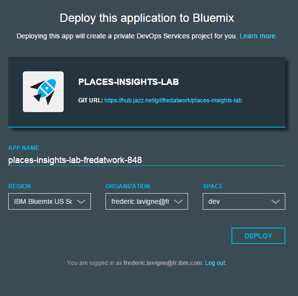
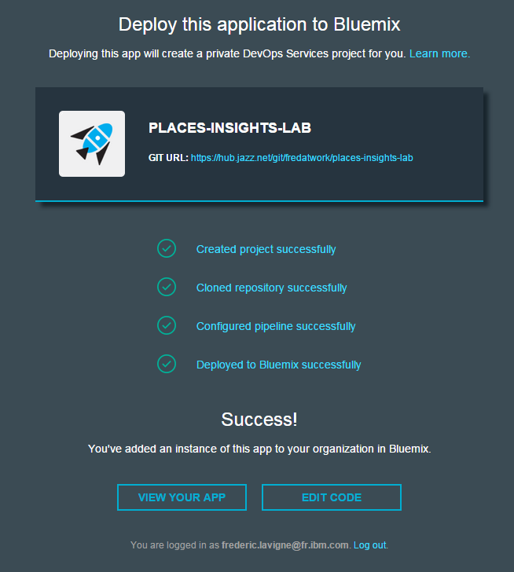
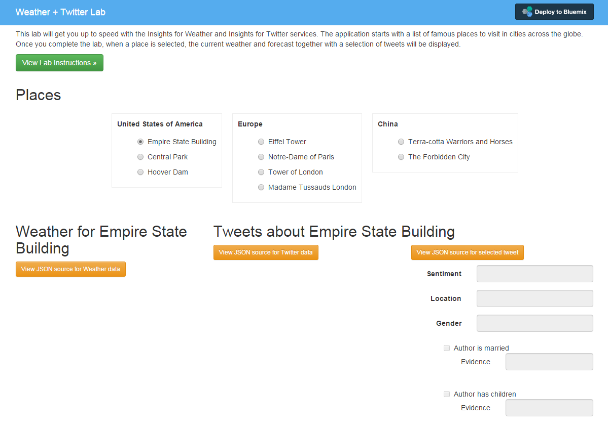
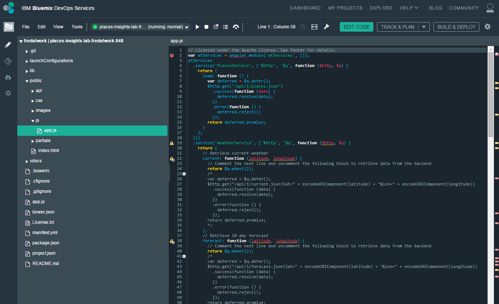
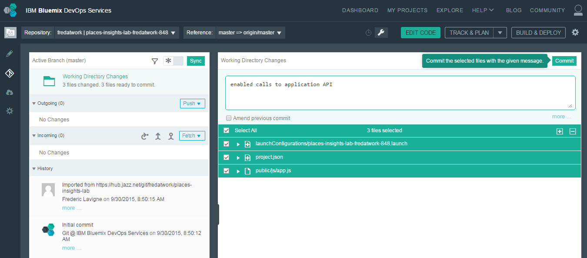
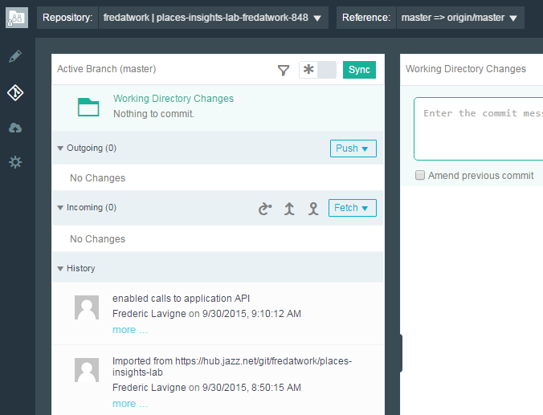
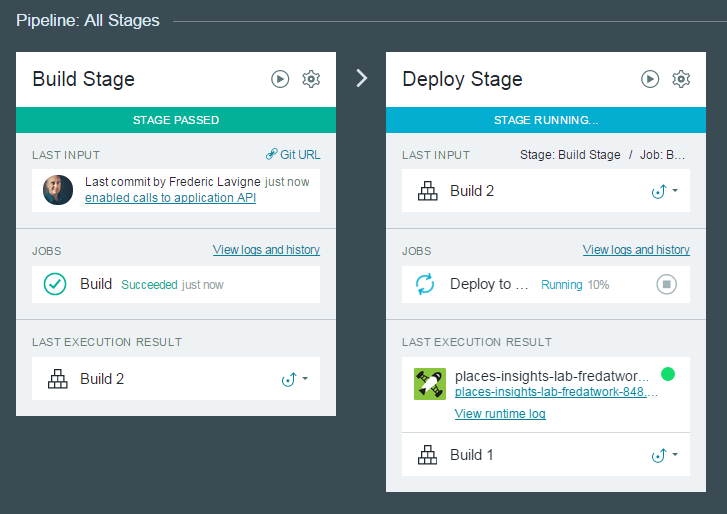
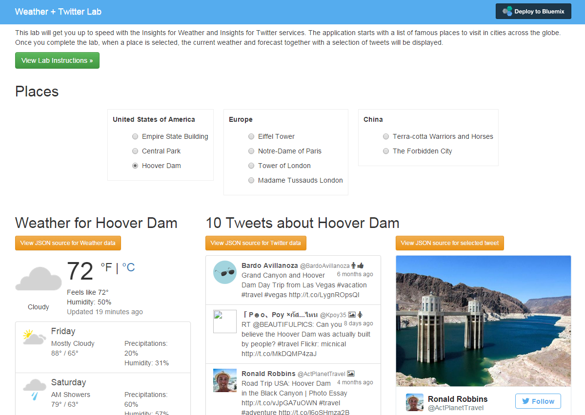
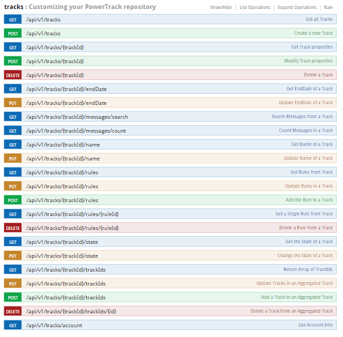

# Places Insights Hands on Labs

Places Insights provides weather observation and related tweets for famous places to visit.
It uses the [Insights for Twitter][insights-twitter-url] and [Insights for Weather][insights-weather-url] services in IBM Bluemix.
The lab will guide you through deploying your own instance of the application in IBM Bluemix
and modifying the code to retrieve data from the two services.

Let's get started. The first thing to do is to build out the shell of our application in Bluemix.

*Command-line aficionados, if you want to, we got you covered with [this other set of instructions](INSTRUCTIONS-CLI.md).*

## Creating a IBM Bluemix account

1. Sign up for IBM Bluemix at [the registration page][bluemix-signup-url] if you don't already have a IBM Bluemix account.

2. Log in your IBM Bluemix account.

## Deploy this application on IBM Bluemix

1. Click the button below to fork the project into IBM Bluemix DevOps Services and deploy your own instance of this application on IBM Bluemix.

  

2. From here you will be taken to a page, where you will be prompted to name your app. A sample name is provided for you, but feel free to give your application any name you like (if the name is taken by another user, you will be prompted to try another name).

  

  **Note:** You can keep the default settings for Region, Organization and Space.

3. Once you have named your application, click the Deploy button to begin the deploy process to IBM Bluemix. During this process, IBM Bluemix will automatically build and deploy our application based on the GitHub repository.

4. Once the application has finished deploying, you will see a "Success!" message.

  

The process has created a new private DevOps Services project, a git clone of the lab source code repository, built your application and deployed it to IBM Bluemix. In addition, it configured a Build & Deploy pipeline that will get triggered whenever your commit changes to the Git repository. We will see it in action when we will modify the application code.

## Test the application

Now that we have deployed our application to IBM Bluemix, the next step is to test out the application in its current state. Afterwards we will build out more functionality into the application.

1. Go to the IBM Bluemix Dashboard by selecting "Dashboard" from the header bar.

2. Select the application you just created under **Applications**.

3. Click the first link near **Routes** at the top of the screen. This takes you to your application.

  

This application proposes a list of places across the globe. Once you will have completed this lab, it will update the display with the current weather, a 10 day forecast for the selected location and a list of tweets referring to this place.

  

The application uses Node.JS for the backend, AngularJS for the user interface and two IBM Bluemix services:
* The [Insights for Weather][insights-weather-url] service provides weather observation and forecast for a specified geolocation.
* The [Insights for Twitter][insights-twitter-url] service provides access to Twitter Decahose (10% of Twitter data) and Twitter PowerTrack (100% of Twitter data) together with sentiment analysis and social enrichments.

## Modify the existing application

Now that you have the basics running it is time to add more functionality to this application, mainly retrieving weather and tweets for the selected location.

1. Let's edit our source code. Back on the application overview page in IBM Bluemix, you will see a link to the Jazz Hub repository, and a button to **Edit Code**. Click on **Edit Code**

  
   
2. Clicking on **Edit Code** will take you to the Jazz Hub repository, which will allow us to edit and push new versions of our code to the application.

3. With the repository, navigate to `public/js/app.js` and open that file to view the application source code

  

4. Locate the comment *Retrieve current weather*. The implementation of the function currently returns an empty object. Comment the line returning the empty object and uncomment the actual code calling the server API. Note that the implementation calls an API on the backend, passing the latitude and longitude of a location.

5. Repeat the same operation for the comment *Retrieve 10 day forecast*. The code to uncomment will call the backend API to get weather forecast.

6. Repeat the same operation for the comment *Retrieve tweets for location*. The code to uncomment will call the backend API to get some tweets about the location.
  
7. Click on File > Save or press Ctrl+S

## Deploy

1. The last step in order to complete our application is to deploy our changes to IBM Bluemix. To do this, we need to push our new code to the application. In the code editor screen, switch to the Git Repository view - the 2nd icon in the left navigation bar.

  

2. Locate your changes to app.js file. Check it (select it), add a commit message and click **Commit**

  

3. Click **Sync** to send your changes from this workspace to the main repository and trigger a deploy of your app.

  

4. Finally, click on **Build & Deploy** to see the deploy process.

  

## Test

To test our changes, navigate back to the application screen on IBM Bluemix and select your application route. The "Build & Deploy" may take few minutes to complete. During that time you may see a message like *404 Not Found: Requested route ('myapp.mybluemix.net') does not exist.* when accessing your application.

In the new version of the application, you will be able to view the current weather, the weather forecast and tweets for the selected place.

  

### Behind the scene

When the user selects a place, the function `updateInsights` in `public/js/app.js` is called.
This function will trigger the right API calls to retrieve Weather and Twitter data.

| the call to retrieve... | is implemeted in [public/js/app.js](public/js/app.js) as... | on the backend, in [lib/server.js](lib/server.js) it is received by... | and delegated to... | finally when the response comes back, it is rendered by |
| --------------- |-------------------------|---------------------|-------------------------------------------------------|--------------|
| Current weather | WeatherService#current  | #api_weatherCurrent  | [lib/weather.js](lib/weather.js) #currentByGeolocation | [weather.html](public/partials/weather.html) |
| 10 day forecast | WeatherService#forecast | #api_weatherForecast | [lib/weather.js](lib/weather.js) #tendayByGeolocation  | [weather.html](public/partials/weather.html) |
| Tweets          | TwitterService#tweets   | #api_tweets          | [lib/twitter.js](lib/twitter.js) #search               | [twitter.html](public/partials/twitter.html) |

### Insights for Weather API

Opening [lib/weather.js](lib/weather.js), you can find the implementation of the calls to the Insights for Weather service.
The service [REST APIs](https://twcservice.mybluemix.net/rest-api/) are:
  
  
All operations listed above take a geolocation as input together with a language for the messages being returned
(for example, en-US, es, es-MX, fr-FR) and units of measure for the data (for example, e=Imperial(English), m=Metric, h=Hybrid).

### Insights for Twitter API

The calls to the Insights for Twitter service are implemented in [lib/twitter.js](lib/twitter.js).
The service has two sets of [REST APIs](https://cdeservice.mybluemix.net/rest-api/):
  * one to query Twitter Decahose (10% of Twitter) - this is the one used in our application
  
  * and one to query Twitter PowerTrack (100% of Twitter)
  

## Congratulations

You have completed the lab!

## Want to go further?

Here are some suggestions to improve the application:
  * Insights for Twitter and Insights for Weather API allow querying language-specific data.
    Improve the application by automatically detecting the user language or providing a language selector
    to display weather data and tweets in the selected language.
  * Retrieve and display hourly forecast from the Insights for Weather service
  * Use a map instead of hardcoded locations.

## Credits

* [json formatter](https://github.com/mohsen1/json-formatter)
* [hapi](http://hapijs.com/)
* [cfenv](https://github.com/cloudfoundry-community/node-cfenv)

## Privacy Notice
The lab application includes code to track deployments to IBM Bluemix and other Cloud Foundry platforms. The following information is sent to a [Deployment Tracker](https://github.com/IBM-Bluemix/cf-deployment-tracker-service) service on each deployment:

* Application Name (application_name)
* Space ID (space_id)
* Application Version (application_version)
* Application URIs (application_uris)

This data is collected from the VCAP_APPLICATION environment variable in IBM Bluemix and other Cloud Foundry platforms. This data is used by IBM to track metrics around deployments of sample applications to IBM Bluemix. Only deployments of sample applications that include code to ping the Deployment Tracker service will be tracked.

### Disabling Deployment Tracking

Deployment tracking can be disabled by removing `require("cf-deployment-tracker-client").track();` from the beginning of the `app.js` file.

[bluemix-signup-url]: https://console.ng.bluemix.net/registration/
[insights-twitter-url]: https://console.ng.bluemix.net/catalog/insights-for-twitter/
[insights-weather-url]: https://console.ng.bluemix.net/catalog/insights-for-weather/
[bluemix-console-url]: https://console.ng.bluemix.net/
